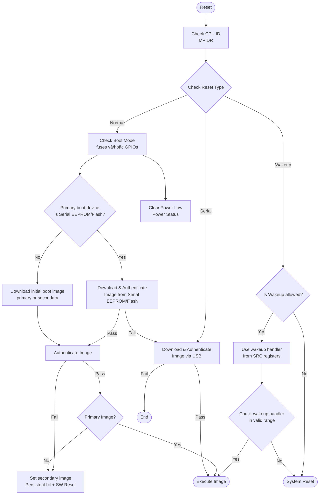
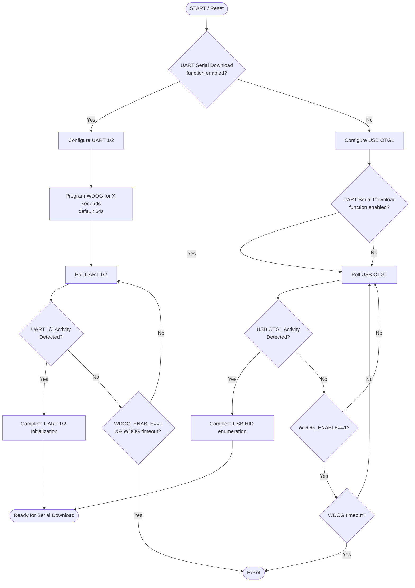
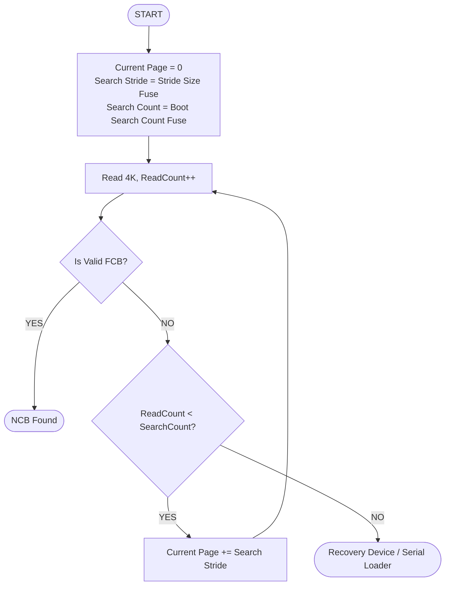
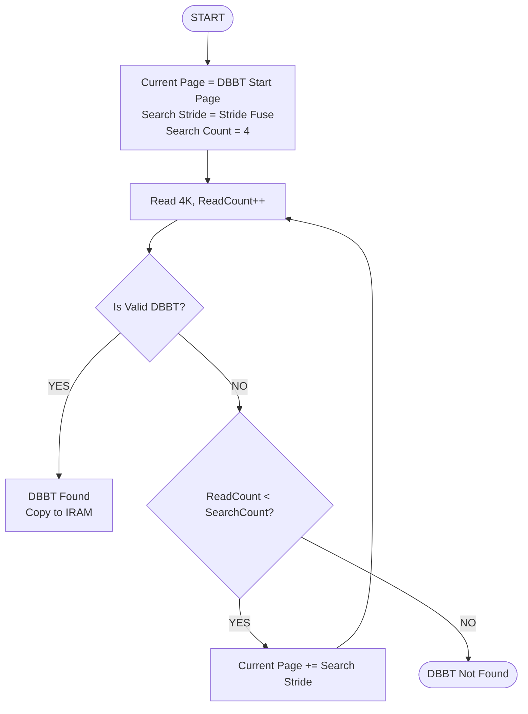
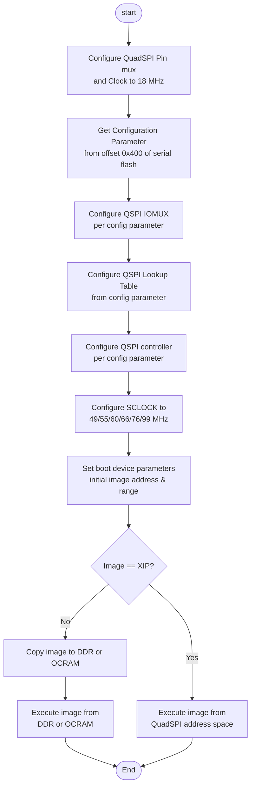
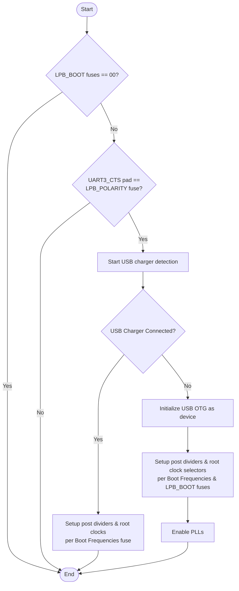
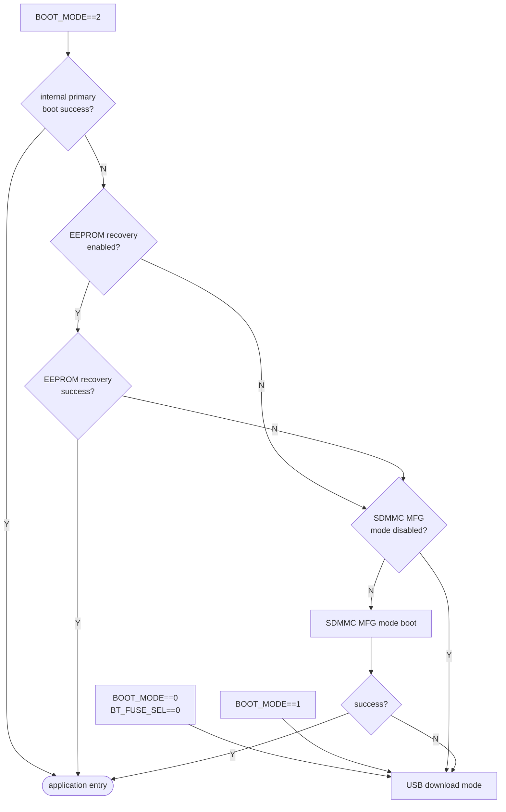

# i.MX 6ULL — Chapter 8: System Boot

> Tài liệu tham khảo: *i.MX 6ULL Applications Processor Reference Manual, Rev. 1, 11/2017 — NXP Semiconductors*

---

## 8.1 Tổng quan

Quá trình boot bắt đầu tại **Power-On Reset (POR)**, nơi hardware reset logic buộc lõi ARM bắt đầu thực thi từ on-chip boot ROM.

Boot ROM sử dụng thanh ghi nội bộ `BOOT_MODE[1:0]` kết hợp với các eFUSE và/hoặc GPIO để xác định luồng boot.

**Tính năng chính của ROM:**
- Hỗ trợ boot từ nhiều thiết bị
- Serial downloader (USB OTG và UART)
- Device Configuration Data (DCD) và plugin
- High-Assurance Boot (HAB) — chữ ký số và mã hóa
- Wake-up từ các chế độ low-power

**Thiết bị boot được hỗ trợ:**
- NOR flash
- NAND flash
- OneNAND flash
- SD/MMC
- Serial (SPI) NOR flash và EEPROM
- QuadSPI (QSPI) flash

---

## 8.2 Boot Modes

### 8.2.1 Boot Mode Pin Settings

`BOOT_MODE` được khởi tạo bằng cách lấy mẫu `BOOT_MODE0` và `BOOT_MODE1` tại cạnh lên của `POR_B`. Sau khi lấy mẫu, trạng thái tiếp theo của các chân này không ảnh hưởng đến thanh ghi `BOOT_MODE` nội bộ. Có thể đọc qua trường `BMOD[1:0]` của `SRC_SBMR2`.

#### Bảng 8-1. Boot MODE Pin Settings

| BOOT_MODE[1:0] | Loại Boot |
|----------------|-----------|
| `00` | Boot From Fuses |
| `01` | Serial Downloader |
| `10` | Internal Boot |
| `11` | Reserved |

---

### 8.2.2 High-Level Boot Sequence (Hình 8-1)



---

### 8.2.3 Boot From Fuses (BOOT_MODE = 00b)

Tương tự Internal Boot nhưng **bỏ qua GPIO boot override pins** — chỉ sử dụng eFUSE settings.

Luồng điều khiển bởi fuse `BT_FUSE_SEL`:
- `BT_FUSE_SEL = 0` → Nhảy thẳng vào **Serial Downloader** (boot device chưa lập trình)
- `BT_FUSE_SEL = 1` → Thực hiện boot bình thường từ thiết bị đã chọn

---

### 8.2.4 Serial Downloader — Boot Flow (Hình 8-2)



---

### 8.2.5 Internal Boot (BOOT_MODE = 10b)

ROM thực thi boot code từ internal boot ROM, thực hiện:
1. Khởi tạo phần cứng
2. Nạp program image từ thiết bị boot đã chọn
3. Xác thực image qua HAB library
4. Nhảy đến địa chỉ từ program image

Nếu lỗi → nhảy vào Serial Downloader.

Điều khiển bởi `BT_FUSE_SEL`:
- `BT_FUSE_SEL = 1` → Tất cả boot options điều khiển bởi eFUSE (Bảng 8-2)
- `BT_FUSE_SEL = 0` → Các tham số có thể override bằng GPIO pins (Bảng 8-3)

---

### 8.2.6 Boot Security Settings

| Mức | Mô tả |
|-----|-------|
| **Closed** | Dành cho sản phẩm secure. Tất cả HAB functions thực thi, SNVS vào Secure state, image phải được xác thực trước khi chạy. Nếu lỗi → chuyển sang serial downloader. |
| **Open** | Dành cho phát triển / sản phẩm không cần secure. HAB functions thực thi như Closed nhưng lỗi chỉ được log, không ảnh hưởng luồng boot. Image vẫn chạy kể cả khi xác thực thất bại. |
| **Field Return** | Dành cho các linh kiện trả về từ sản phẩm đã xuất xưởng. |

---

## 8.3 Device Configuration

### 8.3.1 Boot eFUSE Descriptions

#### Bảng 8-2. Boot eFUSE Descriptions

| Fuse | Loại | Định nghĩa | GPIO | Giá trị mặc định | Thiết lập |
|------|------|-----------|------|-----------------|-----------|
| DIR_BT_DIS | OEM | Vô hiệu hóa các NXP reserved modes | NA | 0 | `0`=Reserved modes enabled · `1`=Disabled (cần blow cho hoạt động bình thường) |
| BT_FUSE_SEL | OEM | Chọn nguồn cấu hình boot (GPIO hay eFUSE) | NA | 0 | BOOT_MODE=10: `0`=GPIO override, `1`=eFUSE · BOOT_MODE=00: `0`=Nhảy Serial DL, `1`=Boot từ eFUSE |
| SEC_CONFIG[1:0] | OEM/NXP | Cấu hình bảo mật | NA | 01 | `00`=Reserved · `01`=Open · `1x`=Closed |
| FIELD_RETURN | OEM | Kích hoạt NXP reserved modes | — | — | `0`=Dựa theo DIR_BT_DIS · `1`=Enabled |
| SRK_HASH[255:0] | OEM | 256-bit hash của super root key | NA | 0 | Dùng bởi HAB |
| UNIQUE_ID[63:0] | NXP | Device Unique ID 64-bit | NA | Unique | Dùng bởi HAB |
| BT_MMU_DISABLE | OEM | Disable MMU/L1 D Cache/PL310 | No | 0 | `0`=Enabled by ROM · `1`=Disabled by ROM |
| L1 I-Cache DISABLE | OEM | Disable L1 I Cache | No | 0 | `0`=Enabled · `1`=Disabled |
| BT_FREQ | OEM | Tần số boot | Yes | 0 | `0`=ARM 396MHz/DDR 396MHz/AXI 198MHz · `1`=ARM 198MHz/DDR 307MHz/AXI 153MHz |
| BOOT_CFG1[7:0] | OEM | Boot configuration 1 | Yes | 0 | Tùy thuộc boot mode |
| BOOT_CFG2[7:0] | OEM | Boot configuration 2 | Yes | 0 | Tùy thuộc boot mode |
| BOOT_CFG4[6:0] | OEM | Boot configuration 4 | — | 0 | Tùy thuộc boot mode |
| BOOT_CFG4[7] | OEM | Infinite Loop Enable (debug) | Yes | 0 | `0`=Disabled · `1`=Enabled |
| LPB_BOOT | OEM | USB Low-Power Boot | No | 0 | `00`=396MHz · `01`=396MHz · `10`=198MHz · `11`=99MHz |
| BT_LPB_POLARITY | OEM | USB LPB GPIO polarity | No | 0 | `0`=Low=low-power · `1`=High=low-power |
| WDOG_ENABLE | OEM | Watchdog reset counter enable | No | 0 | `0`=Disabled · `1`=Enabled trong serial downloader |
| SRK_REVOKE[2:0] | OEM | SRK revocation mask | No | 0 | — |
| DISABLE_SDMMC_MFG | OEM | Disable SDMMC manufacture mode | Yes | 0 | `0`=Enable · `1`=Disable |
| PAD_SETTINGS | OEM | Override giá trị IO PAD | No | 0 | [0]=Slew Rate · [3:1]=Drive Strength · [5:4]=Speed |

---

### 8.3.2 GPIO Boot Overrides

#### Bảng 8-3. GPIO Override Contact Assignments

| Package Pin | Hướng khi Reset | eFUSE tương ứng |
|-------------|----------------|-----------------|
| BOOT_MODE1 | Input | Boot mode selection |
| BOOT_MODE0 | Input | Boot mode selection |
| LCD1_DATA00 | Input | BOOT_CFG1[0] |
| LCD1_DATA01 | Input | BOOT_CFG1[1] |
| LCD1_DATA02 | Input | BOOT_CFG1[2] |
| LCD1_DATA03 | Input | BOOT_CFG1[3] |
| LCD1_DATA04 | Input | BOOT_CFG1[4] |
| LCD1_DATA05 | Input | BOOT_CFG1[5] |
| LCD1_DATA06 | Input | BOOT_CFG1[6] |
| LCD1_DATA07 | Input | BOOT_CFG1[7] |
| LCD1_DATA08 | Input | BOOT_CFG2[0] |
| LCD1_DATA09 | Input | BOOT_CFG2[1] |
| LCD1_DATA10 | Input | BOOT_CFG2[2] |
| LCD1_DATA11 | Input | BOOT_CFG2[3] |
| LCD1_DATA12 | Input | BOOT_CFG2[4] |
| LCD1_DATA13 | Input | BOOT_CFG2[5] |
| LCD1_DATA14 | Input | BOOT_CFG2[6] |
| LCD1_DATA15 | Input | BOOT_CFG2[7] |
| LCD1_DATA16 | Input | BOOT_CFG4[0] |
| LCD1_DATA17 | Input | BOOT_CFG4[1] |
| LCD1_DATA18 | Input | BOOT_CFG4[2] |
| LCD1_DATA19 | Input | BOOT_CFG4[3] |
| LCD1_DATA20 | Input | BOOT_CFG4[4] |
| LCD1_DATA21 | Input | BOOT_CFG4[5] |
| LCD1_DATA22 | Input | BOOT_CFG4[6] |
| LCD1_DATA23 | Input | BOOT_CFG4[7] |

---

## 8.4 Device Initialization

### 8.4.1 Internal ROM/RAM Memory Map (Hình 8-3)

```
ROM Memory Map                      RAM Memory Map
─────────────────────────────────   ─────────────────────────────────
0x00000000  ROM Boot Strap           0x00900000  OCRAM Free Area (68KB)
0x00000080  Reset Exception Handler  0x00907000  MMU Table (20KB)
0x00000100  ROM Version & Copyright  0x00918000  Stack (8120 bytes)
0x00000180  HAB API Vector Table     0x0091D000
0x000001E0  ROM API Vector Table     0x0091E000  Reserved (4KB)
0x00000200  Log Buffer Pointer       0x0091FFB8
            RAM Exception Vector     0x0091FFF0  RAM Exception Vector
0x00017FFF                           0x0091FFFF
                                     0x00928000  Reserved (28KB)
```

> **Lưu ý:** Toàn bộ vùng OCRAM có thể sử dụng tự do sau khi boot xong.

---

### 8.4.2 Boot Block Activation

Các block ROM cấu hình và sử dụng trong quá trình boot (theo thứ tự alphabet):

| Block | Chức năng |
|-------|-----------|
| APBH | DMA engine để điều khiển module GPMI |
| BCH | Hardware ECC 40-bit với AXI bus master |
| CCM | Clock Control Module |
| ECSPI | Enhanced Configurable Serial Peripheral Interface |
| EIM | External Interface Module (NOR, OneNAND) |
| GPMI | NAND controller pin interface |
| OCOTP_CTRL | On-Chip OTP Controller (chứa eFUSEs) |
| IOMUXC | I/O Multiplexer Control |
| IOMUXC GPR | I/O Multiplexer Control General-Purpose Registers |
| DCP | Data Co-Processor |
| QSPI | QuadSPI flash |
| SNVS | Secure Non-Volatile Storage |
| SRC | System Reset Controller |
| UART | Universal Asynchronous Receiver/Transmitter |
| USB | Serial download của boot device provisioning program |
| USDHC | Ultra-Secure Digital Host Controller |
| WDOG-1 | Watchdog timer |

---

### 8.4.3 Clocks at Boot Time

#### Bảng 8-4. Normal Frequency Clocks Configuration

| Clock | CCM Signal | Source | Freq (BT_FREQ=0) | Freq (BT_FREQ=1) |
|-------|-----------|--------|-----------------|-----------------|
| ARM PLL | pll1_sw_clk | — | 396 MHz | 396 MHz |
| System PLL | pll2_sw_clk | — | 528 MHz | 528 MHz |
| USB PLL | pll3_sw_clk | — | 480 MHz | 480 MHz |
| AHB | ahb_clk_root | 528 MHz PLL/PFD352 | 132 MHz | 88 MHz |
| IPG | ipg_clk_root | 528 MHz PLL/PFD352 | 66 MHz | 44 MHz |

#### Bảng 8-5. Danh sách Clock bị tắt (chọn lọc)

| Tên Clock | Enabled cho thiết bị boot |
|-----------|--------------------------|
| CCGR0_APBHDMA_CLK_SEL | NAND |
| CCGR1_ECSPI1_CLK_SEL | ECSPI1 |
| CCGR1_ECSPI2_CLK_SEL | ECSPI2 |
| CCGR1_ECSPI3_CLK_SEL | ECSPI3 |
| CCGR1_ECSPI4_CLK_SEL | ECSPI4 |
| CCGR0_UART2_CLK_SEL | UART2 |
| CCGR3_QSPI1_CLK_SEL | QSPI1 |
| CCGR4_RAWNAND_U_BCH_INPUT_A_CLK_SEL | NAND |
| CCGR4_RAWNAND_U_GPMI_BCH_INPUT_BCG_CLK_SEL | NAND |
| CCGR4_RAWNAND_U_GPMI_BCH_INPUT_GPMI_CLK_SEL | NAND |
| CCGR4_RAWNAND_U_GPMI_INPUT_APB_CLK_SEL | NAND |
| CCGR6_USBOH3_CLK_SEL | USB |
| CCGR6_USDHC1_CLK_SEL | USDHC1 |
| CCGR6_USDHC2_CLK_SEL | USDHC2 |
| CCGR6_EMI_SLOW_CLK_SEL | NOR, OneNAND |
| Tất cả còn lại | Không enabled |

---

### 8.4.4 Enabling MMU and Caches

- **L1 Instruction cache**: enabled lúc bắt đầu image download
- **L1 Data cache, L2 cache, MMU**: enabled trong quá trình image authentication; bị tắt khi HAB authentication hoàn tất
- Tất cả đều điều khiển bởi eFUSE, mặc định là enabled

> Nếu boot không secure (`SEC_CONFIG=Open`) với CSF pointer = NULL, khuyến nghị blow fuse `BT_MMU_DISABLE`.

---

### 8.4.7 Persistent Bits

#### Bảng 8-6. Persistent Bits

| Tên Bit | Vị trí | Mô tả |
|---------|--------|-------|
| PERSIST_SECONDARY_BOOT | SRC_GPR10[30] | Xác định image dùng: primary hay secondary |
| PERSIST_BLOCK_REWRITE | SRC_GPR10[29] | Cảnh báo: có lỗi trong các NAND block chứa application image |
| PERSISTENT_ENTRY0[31:0] | SRC_GPR1[31:0] | Entry function cho CPU0 wake up từ low-power mode |
| PERSISTENT_ARG0[31:0] | SRC_GPR2[31:0] | Argument của entry function cho CPU0 wake up |
| PERSIST_OVERRIDE_SBMR1 | SRC_GPR10[28] | Chỉ thị ROM dùng SRC_GPR9 thay SBMR1 (chỉ hợp lệ cho WDOG reset) |
| PERSIST_SBMR1_VALUE | SRC_GPR9 | Giá trị override SBMR1 |

---

## 8.5 Boot Devices (Internal Boot)

#### Bảng 8-7. Boot Device Selection

| BOOT_CFG1[7:4] | Thiết bị Boot |
|----------------|--------------|
| `0000` | NOR/OneNAND (EIM) |
| `0001` | QSPI |
| `0011` | Serial ROM (SPI) |
| `010x` | SD/eSD/SDXC |
| `011x` | MMC/eMMC |
| `1xxx` | Raw NAND |

---

### 8.5.1 NOR Flash / OneNAND qua EIM

#### Bảng 8-8. EIM Boot eFUSE Descriptions

| Fuse | Loại | Định nghĩa | GPIO | Mặc định | Thiết lập |
|------|------|-----------|------|---------|-----------|
| BOOT_CFG1[7:4] | OEM | Chọn thiết bị boot | Yes | 0000 | `0000`=EIM |
| BOOT_CFG1[3] | OEM | NOR/OneNAND | Yes | 0 | `0`=NOR · `1`=OneNAND |
| BOOT_CFG2[7:6] | OEM | Muxing scheme | Yes | 00 | `00`=Muxed 16-bit · `10`=Not muxed 16-bit |
| BOOT_CFG2[5:4] | OEM | OneNAND page size | Yes | 00 | `00`=1KB · `01`=2KB · `10`=4KB |

#### Bảng 8-9. EIM IOMUX Pin Configuration

| Signal | A/D16 (Muxed, 16-bit) | A+D (Not muxed, 16-bit) |
|--------|----------------------|------------------------|
| DATA0–DATA7 | CSI_DATA00–07.alt4 | LCD_DATA08–15.alt4 |
| DATA8–DATA15 | NAND_DATA00–07.alt4 | LCD_DATA16–23.alt4 |
| ADDR0–ADDR7 | CSI_DATA00–07.alt4 | — |
| ADDR8–ADDR15 | NAND_DATA00–07.alt4 | — |
| ADDR16 | NAND_CLE.alt4 | — |
| ADDR17 | NAND_ALE.alt4 | — |
| ADDR18 | NAND_CE1_B.alt4 | — |
| ADDR19–ADDR24 | SD1_CMD/CLK/DATA0–3.alt4 | — |
| ADDR25 | ENET2_RXER.alt4 | — |
| ADDR26 | ENET2_CRS_DV.alt4 | — |

---

### 8.5.2 NAND Flash

#### Bảng 8-10. NAND Boot eFUSE Descriptions

| Fuse | Loại | Định nghĩa | GPIO | Mặc định | Thiết lập |
|------|------|-----------|------|---------|-----------|
| BOOT_CFG1[7] | OEM | Boot device selection | Yes | 0 | `1`=NAND |
| BOOT_CFG1[6] | OEM | BT_TOGGLEMODE | Yes | 0 | `0`=Raw NAND · `1`=Toggle mode NAND |
| BOOT_CFG1[5:4] | OEM | Pages in block | Yes | 0 | `00`=128 · `01`=64 · `10`=32 · `11`=256 |
| BOOT_CFG1[3:2] | OEM | Number of devices | Yes | 00 | `00`=1 · `01`=2 · `10`=4 |
| BOOT_CFG1[1:0] | OEM | Row address cycles | Yes | 00 | `00`=3 · `01`=2 · `10`=4 · `11`=5 |
| BOOT_CFG2[7:5] | OEM | Toggle mode read latency | Yes | 000 | `000`=16 cycles · `001`–`111`=1–7 cycles |
| BOOT_CFG2[4:3] | OEM | Boot search count | Yes | 00 | `00/01`=2 · `10`=4 · `11`=8 |
| BOOT_CFG2[2] | OEM | Boot frequencies | Yes | 0 | `0`=500/400MHz · `1`=250/200MHz |
| BOOT_CFG2[1] | OEM | Reset time | Yes | 0 | `0`=12ms · `1`=22ms (LBA NAND) |
| 0x6D0[11:8] | OEM | READ_RETRY_SEQ_ID | Yes | 0000 | Xem bảng 8-13 |

#### FCB Search Flow (Hình 8-5)



#### DBBT Search Flow (Hình 8-6)



#### Bảng 8-11. Flash Control Block (FCB) Structure

| Tên | Byte bắt đầu | Kích thước (bytes) | Mô tả |
|-----|------------|-------------------|-------|
| Reserved | 0 | 4 | Dành cho Fingerprint #1 (Checksum) |
| FingerPrint | 4 | 4 | `0x20424346` = "FCB" |
| Version | 8 | 4 | `0x00000001` |
| m_NANDTiming | 12 | 8 | 8 tham số timing NAND: data_setup, data_hold, address_setup, dsample_time, nand_timing_state, REA, RLOH, RHOH |
| PageDataSize | 20 | 4 | Số byte data trong một page (2048, 4096, 8192) |
| TotalPageSize | 24 | 4 | Tổng số byte trong một page (2112, 4224/4314, 8568) |
| SectorsPerBlock | 28 | 4 | Số pages per block (64 hoặc 128) |
| EccBlockNEccType | 44 | 4 | Mức BCH ECC cho Block BN (0–20 → 0,2,4,...40-bit) |
| EccBlock0Size | 48 | 4 | Kích thước Block B0 |
| EccBlockNSize | 52 | 4 | Kích thước Block BN |
| EccBlock0EccType | 56 | 4 | Mức BCH ECC cho Block B0 |
| MetadataBytes | 60 | 4 | Số metadata bytes |
| NumEccBlocksPerPage | 64 | 4 | Số ECC blocks BN (không kể B0) |
| Firmware1_startingPage | 104 | 4 | Địa chỉ page của firmware copy 1 |
| Firmware2_startingPage | 108 | 4 | Địa chỉ page của firmware copy 2 |
| PagesInFirmware1 | 112 | 4 | Kích thước firmware 1 (pages) |
| PagesInFirmware2 | 116 | 4 | Kích thước firmware 2 (pages) |
| DBBTSearchAreaStartAddress | 120 | 4 | Địa chỉ page tìm kiếm DBBT |
| BadBlockMarkerByte | 124 | 4 | Offset byte trong BCH page để swap với metadata[0] |
| BadBlockMarkerStartBit | 128 | 4 | Bit offset trong BadBlockMarkerByte |
| BBMarkerPhysicalOffset | 132 | 4 | Offset nơi nhà sản xuất đánh dấu bad block |
| BCHType | 136 | 4 | `0`=BCH20 · `1`=BCH40 |
| TMTiming2_ReadLatency | 140 | 4 | Toggle mode: Read latency |
| TMTiming2_PreambleDelay | 144 | 4 | Toggle mode: Preamble delay |
| TMTiming2_CEDelay | 148 | 4 | Toggle mode: CE delay |
| TMTiming2_PostambleDelay | 152 | 4 | Toggle mode: Postamble delay |
| TMTiming2_CmdAddPause | 156 | 4 | Toggle mode: Cmd Add pause |
| TMTiming2_DataPause | 160 | 4 | Toggle mode: Data pause |
| TMSpeed | 164 | 4 | Toggle mode speed: 0=24MHz, 1=33MHz, 2=40MHz, 3=50MHz, 4=66MHz, 5=80MHz, 6=100MHz, 7=133MHz, 8=160MHz, 9=200MHz |
| Onfi_sync_enable | 180 | 4 | Enable Onfi NAND sync mode |
| Onfi_sync_speed | 184 | 4 | Tốc độ Onfi sync: 0=24MHz ... 9=200MHz |
| DISBB_Search | 216 | 4 | Disable bad block search, chỉ dùng DBBT |
| Reserved | 220 | 64 | Dự phòng |

#### Bảng 8-12. DBBT Structure

| Tên | Byte bắt đầu | Kích thước (bytes) | Mô tả |
|-----|------------|-------------------|-------|
| reserved | 0 | 4 | — |
| FingerPrint | 4 | 4 | `0x44424254` = "DBBT" |
| Version | 8 | 4 | `0x00000001` |
| reserved | 12 | 4 | — |
| DBBT_NUM_OF_PAGES | 16 | 4 | Kích thước DBBT (pages) |
| reserved | 20 | 4×PageSize−20 | — |
| Number of Entries | 4×PageSize+4 | 4 | Số bad blocks |
| Bad Block Number | 4×PageSize+8 | 4 | Bad block thứ nhất |
| Bad Block Number | 4×PageSize+12 | 4 | Bad block thứ hai |
| ... | ... | 4 | Các bad block tiếp theo |

#### Bảng 8-13. Read-Retry Sequences

| Vendor | Process | READ_RETRY_SEQ_ID | Ghi chú |
|--------|---------|-------------------|---------|
| Micron | 20nm | `0001` | — |
| Toshiba | A19nm | `0010` | — |
| Toshiba | 19nm | `0011` | — |
| SanDisk | 19nm | `0100` | — |
| SanDisk | 1ynm | `0101` | — |
| Hynix | 26nm | `0111` | — |
| Hynix | 20nm A Die | `0110` | — |
| Hynix | 20nm B Die | `1000` | — |
| Hynix | 20nm C Die | `1001` | — |

#### Bảng 8-14. NAND IOMUX Pin Configuration

| Signal | Pad Name |
|--------|---------|
| NAND.CLE | NAND_CLE.alt0 |
| NAND.ALE | NAND_ALE.alt0 |
| NAND.DATA00–07 | NAND_DATA00–07.alt0 |
| NAND.RE_B | NAND_RE_B.alt0 |
| NAND.WE_B | NAND_WE_B.alt0 |
| NAND.CE0_B | NAND_CE0_B.alt0 |
| NAND.CE1_B | NAND_CE1_B.alt0 |
| NAND.DQS | NAND_DQS.alt0 |
| NAND.READY_B | NAND_READY_B.alt0 |
| NAND.CE2_B | CSI_MCLK.alt2 |
| NAND.CE3_B | CSI_PIXCLK.alt2 |
| NAND.WP_B | NAND.WP_B.alt0 |

---

### 8.5.3 Expansion Device (SD/MMC/eMMC)

#### Bảng 8-15. USDHC Boot eFUSE Descriptions

| Fuse | Loại | Định nghĩa | GPIO | Mặc định | Thiết lập |
|------|------|-----------|------|---------|-----------|
| 0x450[7:6] | OEM | Chọn boot device | Yes | 00 | `01`=USDHC |
| 0x450[5] | OEM | SD/MMC selection | Yes | 0 | `0`=SD/eSD/SDXC · `1`=MMC/eMMC |
| 0x450[4] | OEM | Fast boot | Yes | 0 | `0`=Normal · `1`=Fast boot |
| 0x450[3:2] | OEM | Speed mode / eMMC ack | Yes | 00 | MMC: `0x`=Normal, `1x`=High · SD: `00`=SDR12, `01`=SDR25, `10`=SDR50, `11`=SDR104 |
| 0x450[1] | OEM | SD power cycle / eMMC reset | Yes | 0 | `0`=No action · `1`=Enabled |
| 0x450[0] | OEM | SD loopback clock | Yes | 0 | `0`=Through SD pad · `1`=Direct |
| 0x450[15:13] | OEM | Bus width / calibration step | Yes | 00 | SD: `xx0`=1-bit, `xx1`=4-bit · MMC: `000`=1, `001`=4, `010`=8, `101`=4-bit DDR, `110`=8-bit DDR |
| 0x450[12:11] | OEM | USDHC port selection | Yes | 00 | `00`=USDHC-1 · `01`=USDHC-2 |
| 0x450[9] | OEM | USDHC1 voltage | Yes | 0 | `0`=3.3V · `1`=1.8V |
| 0x460[31:30] | OEM | Power cycle selection | Yes | 00 | `00`=20ms · `01`=10ms · `10`=5ms · `11`=2.5ms |
| 0X460[24] | OEM | SD/MMC DLL enable | Yes | 0 | `0`=Disable · `1`=Enable |
| 0X470[7] | OEM | DLL override | Yes | 0 | `0`=No override · `1`=Override |
| 0X470[6] | OEM | USDHC1 reset polarity | Yes | 0 | `0`=Active low · `1`=Active high |
| 0X470[15] | OEM | USDHC2 reset polarity | Yes | 0 | `0`=Active low · `1`=Active high |

#### Bảng 8-16. SD/MMC Frequencies

| Chế độ | SD | MMC | MMC (DDR mode) |
|--------|-----|-----|----------------|
| Identification | — | 347.22 KHz | — |
| Normal-speed | 25 MHz | 20 MHz | 25 MHz |
| High-speed | 50 MHz | 40 MHz | 50 MHz |
| UHSI SDR50 | 100 MHz | — | — |
| UHSI SDR104 | 200 MHz | — | — |

#### Bảng 8-18. SD/MMC IOMUX Pin Configuration

| Signal | USDHC1 | USDHC2 |
|--------|--------|--------|
| CLK | SD1_CLK.alt0 | NAND_RE_B.alt1 |
| CMD | SD1_CMD.alt0 | NAND_WE_B.alt1 |
| DATA0 | SD1_DATA0.alt0 | NAND_DATA00.alt1 |
| DATA1 | SD1_DATA1.alt0 | NAND_DATA01.alt1 |
| DATA2 | SD1_DATA2.alt0 | NAND_DATA02.alt1 |
| DATA3 | SD1_DATA3.alt0 | NAND_DATA03.alt1 |
| DATA4 | NAND_READY_B.alt1 | NAND_DATA04.alt1 |
| DATA5 | NAND_CE0_B.alt1 | NAND_DATA05.alt1 |
| DATA6 | NAND_CE1_B.alt1 | NAND_DATA06.alt1 |
| DATA7 | NAND_CLE.alt1 | NAND_DATA07.alt1 |
| VSELECT | GPIO1_IO05.alt4 | GPIO1_IO08.alt4 |
| RESET_B | GPIO1_IO09.alt5 | NAND_ALE.alt5 |
| CD_B | UART1_RTS_B.alt2 | — |

#### Secondary Image Table Format (Bảng 8-19)

| Trường | Mô tả |
|--------|-------|
| Reserved (chipNum) | — |
| Reserved (driveType) | — |
| tag | Phải là `0x00112233` (chỉ thị secondary image table hợp lệ) |
| firstSectorNumber | Số sector 512-byte đầu tiên của secondary image |
| Reserved (sectorCount) | — |

---

### 8.5.4 Serial ROM qua SPI

#### Bảng 8-20. Serial ROM Boot eFUSE Descriptions

| Fuse | Loại | Định nghĩa | GPIO | Mặc định | Thiết lập |
|------|------|-----------|------|---------|-----------|
| BOOT_CFG1[7:4] | OEM | Boot device selection | Yes | 0000 | `0011`=Serial ROM |
| BOOT_CFG4[6] | OEM | EEPROM recovery enable | Yes | 0 | `0`=Disabled · `1`=Enabled |
| BOOT_CFG4[5:4] | OEM | CS select (SPI) | Yes | 00 | `00`=SS0 · `01`=SS1 · `10`=SS2 · `11`=SS3 |
| BOOT_CFG4[3] | OEM | SPI addressing | Yes | 0 | `0`=2B (16-bit) · `1`=3B (24-bit) |
| BOOT_CFG4[2:0] | OEM | Port select | Yes | 000 | `000`=ECSPI1 · `001`=ECSPI2 · `010`=ECSPI3 · `011`=ECSPI4 |

#### Bảng 8-21. ECSPI IOMUX Pin Configuration

| Signal | eCSPI1 | eCSPI2 | eCSPI3 | eCSPI4 |
|--------|--------|--------|--------|--------|
| MISO | CSI_DATA07.alt3 | CSI_DATA03.alt3 | UART2_RTS_B.alt8 | ENET2_TX_CLK.alt3 |
| MOSI | CSI_DATA06.alt3 | CSI_DATA02.alt3 | UART2_CTS_B.alt8 | ENET2_TX_EN.alt3 |
| SCLK | CSI_DATA04.alt3 | CSI_DATA00.alt3 | UART2_RX_DATA.alt8 | ENET2_TX_DATA1.alt3 |
| SS0 | CSI_DATA05.alt3 | CSI_DATA01.alt3 | UART2_TX_DATA.alt8 | ENET2_RX_ER.alt3 |
| SS1 | LCD_DATA05.alt8 | LCD_HSYNC.alt8 | NAND_ALE.alt8 | NAND_DATA01.alt8 |
| SS2 | LCD_DATA06.alt8 | LCD_VSYNC.alt8 | NAND_RE_B.alt8 | NAND_DATA02.alt8 |
| SS3 | LCD_DATA07.alt8 | LCD_RESET.alt8 | NAND_WE_B.alt8 | NAND_DATA03.alt8 |

---

## 8.6 QuadSPI Serial Flash Boot

### 8.6.1 QuadSPI eFUSE Configuration

#### Bảng 8-22. QSPI Boot eFUSE Descriptions

| Fuse | Loại | Định nghĩa | GPIO | Mặc định | Thiết lập |
|------|------|-----------|------|---------|-----------|
| BOOT_CFG1[7:4] | OEM | Boot device selection | Yes | 0001 | `0001`=QuadSPI |
| BOOT_CFG1[3] | OEM | QuadSPI interface selection | Yes | 0 | `0`=QSPI1 · `1`=Reserved |

### 8.6.2 QuadSPI Boot Flow (Hình 8-20)



### 8.6.3 QuadSPI Configuration Parameters (Bảng 8-23 — Tóm tắt)

| Tên | Offset | Size (bytes) | Mô tả |
|-----|--------|-------------|-------|
| DQS Loopback | 0 | 4 | `0`=Disable · `1`=Enable |
| Hold Delay | 4 | 4 | Hold delay cho QSPI A/B |
| device_quad_mode_en | 16 | 4 | Gửi Quad enable command tới SPI device |
| device_cmd | 20 | 4 | Command gửi tới SPI device |
| Chip Select hold time | 32 | 4 | CS hold time (serial clock cycles) |
| Chip Select setup time | 36 | 4 | CS setup time (serial clock cycles) |
| Serial Flash A1/A2/B1/B2 size | 40–52 | 4 each | Kích thước từng flash (bytes) |
| Serial Clock Frequency | 56 | 4 | `00`=18MHz · `01`=49MHz · `02`=55MHz · `03`=60MHz · `04`=66MHz · `05`=76MHz · `06`=99MHz |
| Mode of operation | 64 | 4 | `01`=Single · `02`=Dual · `04`=Quad |
| Serial Flash Port B Selection | 68 | 4 | `0`=Không dùng Port B · `1`=Dùng Port B |
| Dual Data Rate mode enable | 72 | 4 | `0`=Disable DDR · `1`=Enable DDR |
| Data Strobe Signal enable | 76 | 4 | `0`=Disable DQS · `1`=Enable DQS |
| Parallel Mode enable | 80 | 4 | `0`=Disable · `1`=Enable |
| Full Speed Phase Selection | 92 | 4 | `0`=Non-inverted · `1`=Inverted |
| Full Speed Delay Selection | 96 | 4 | `0`=1 clock delay · `1`=2 clock delay |
| LUT program sequence | 104 | 256 | 256 bytes Look-Up Table |
| tag | 508 | 4 | End flag của QSPI parameters area |

### 8.6.4 QuadSPI IOMUX Pin Configuration (Bảng 8-24)

| Signal | QSPI1 |
|--------|-------|
| A_SCLK | NAND_WP_B.alt2 |
| A_SS0_B | NAND_DQS.alt2 |
| A_SS1_B | NAND_DATA07.alt2 |
| A_DATA0–3 | NAND_READY_B / CE0_B / CE1_B / CLE.alt2 |
| A_DQS | NAND_ALE.alt2 |
| B_SCLK | NAND_RE_B.alt2 |
| B_SS0_B | NAND_WE_B.alt2 |
| B_SS1_B | NAND_DATA00.alt2 |
| B_DATA0–3 | NAND_DATA02–05.alt2 |
| B_DQS | NAND_DATA01.alt2 |

---

## 8.7 Program Image

### Image Vector Table Offsets (Bảng 8-25)

| Loại thiết bị Boot | IVT Offset | Initial Load Region Size |
|-------------------|-----------|------------------------|
| NOR | 4 KB = 0x1000 | Toàn bộ Image |
| OneNAND | 256 bytes = 0x100 | 1 KB |
| SD/MMC/eSD/eMMC/SDXC | 1 KB = 0x400 | 4 KB |
| SPI EEPROM | 1 KB = 0x400 | 4 KB |

### IVT Format (Bảng 8-26)

| Trường | Mô tả |
|--------|-------|
| header | Tag=`0xD1`, Length=32 bytes, Version=`0x40/0x41` |
| entry | Địa chỉ tuyệt đối của lệnh đầu tiên cần thực thi |
| reserved1 | Dự phòng, phải = 0 |
| dcd | Địa chỉ tuyệt đối của DCD (NULL nếu không dùng DCD) |
| boot data | Địa chỉ tuyệt đối của Boot Data |
| self | Địa chỉ tuyệt đối của IVT (dùng nội bộ bởi ROM) |
| csf | Địa chỉ tuyệt đối của CSF (NULL nếu không secure boot) |
| reserved2 | Dự phòng, phải = 0 |

### Boot Data Structure (Bảng 8-27)

| Trường | Mô tả |
|--------|-------|
| start | Địa chỉ tuyệt đối của image |
| length | Kích thước program image (bytes) |
| plugin | Plugin flag (1 = plugin image) |

### 8.7.2 Device Configuration Data (DCD)

DCD là dữ liệu cấu hình trong program image, cho phép ROM cấu hình các peripheral trước khi chạy code. Kích thước tối đa: **1768 bytes**.

#### DCD Header: Tag=`0xD2`, Version=`0x41`

#### Bảng 8-28. Write Data Command Format

| Trường | Mô tả |
|--------|-------|
| Tag | `0xCC` |
| Length | Chiều dài lệnh (bytes) |
| Parameter | Byte[7:3]=flags, Byte[2:0]=bytes width (1/2/4) |
| Address | Địa chỉ đích |
| Value/Mask | Giá trị hoặc bitmask ghi vào địa chỉ trên |

#### Bảng 8-30. Write Data Command Flags

| Mask | Set | Hành động | Diễn giải |
|------|-----|-----------|-----------|
| 0 | 0 | `*address = val_msk` | Ghi giá trị |
| 0 | 1 | `*address = val_msk` | Ghi giá trị |
| 1 | 0 | `*address &= ~val_msk` | Xóa bitmask |
| 1 | 1 | `*address \|= val_msk` | Set bitmask |

#### Bảng 8-31. Valid DCD Address Ranges

| Vùng địa chỉ | Địa chỉ đầu | Địa chỉ cuối |
|-------------|------------|-------------|
| IOMUXC registers | `0x020E0000` | `0x020E3FFF` |
| IOMUXC GPR | `0x020E4000` | `0x020E7FFF` |
| CCM register set | `0x020C4000` | `0x020C7FFF` |
| ANADIG registers | `0x020C8000` | `0x020C8FFF` |
| MMDC register set | `0x021B0000` | `0x021B3FFF` |
| OCRAM free space | `0x00907000` | `0x00917FF0` |
| EIM registers | `0x021B8000` | `0x021BBFFF` |
| DDR | `0x10000000` | `0xFFFF7FFF` |
| EPIT1 | `0x020D0000` | `0x020D3FFF` |

---

## 8.9 Serial Downloader

### USB HID Reports (Bảng 8-37)

| Report ID | Endpoint | Hướng | Độ dài | Mô tả |
|-----------|---------|-------|--------|-------|
| 1 | control | Host → Device | 17 bytes | SDP command |
| 2 | control | Host → Device | Đến 1025 bytes | Data cho report 1 |
| 3 | interrupt | Device → Host | 5 bytes | HAB security config (`0x12343412`=closed, `0x56787856`=open) |
| 4 | interrupt | Device → Host | Đến 65 bytes | Data phản hồi SDP command |

### USB VID/PID (Bảng 8-38)

| Descriptor | Giá trị |
|-----------|---------|
| VID | `0x15A2` (NXP) |
| PID | `0x007D` |
| Manufacturer | NXP Semiconductors |
| Product | S/SE/NS Blank |

### SDP Command Structure (Bảng 8-42)

| Offset | Size | Tên | Mô tả |
|--------|------|-----|-------|
| 0 | 2 | COMMAND TYPE | `0x0101`=READ_REGISTER · `0x0202`=WRITE_REGISTER · `0x0404`=WRITE_FILE · `0x0505`=ERROR_STATUS · `0x0A0A`=DCD_WRITE · `0x0B0B`=JUMP_ADDRESS · `0x0C0C`=SKIP_DCD_HEADER |
| 2 | 4 | ADDRESS | Địa chỉ thanh ghi hoặc bộ nhớ |
| 6 | 1 | FORMAT | `0x8`=8-bit · `0x10`=16-bit · `0x20`=32-bit |
| 7 | 4 | DATA COUNT | Kích thước dữ liệu đọc/ghi |
| 11 | 4 | DATA | Giá trị ghi (chỉ dùng WRITE_REGISTER) |
| 15 | 1 | RESERVED | — |

### UART Configuration (Bảng 8-39)

| Tham số | Giá trị |
|---------|---------|
| Protocol | RS232 |
| Start bit | 1 bit |
| Stop bit | 1 bit |
| Parity | Không cần |
| Flow control | Không cần |
| Baud rate | 115200 bps |

### UART IOMUX (Bảng 8-41)

| Signal | UART1 | UART2 |
|--------|-------|-------|
| TXD | UART1_TX_DATA.alt0 | UART2_TX_DATA.alt0 |
| RXD | UART1_RX_DATA.alt0 | UART2_RX_DATA.alt0 |

---

## 8.11 USB Low-Power Boot

### Boot Flow (Hình 8-26)



### Bảng 8-43. USB Low-Power Bus Boot Frequencies

| LPB_BOOT | Boot Freq=0 | Boot Freq=1 |
|----------|------------|------------|
| 00 | MMDC=396MHz / FABRIC=198MHz / AHB=132MHz | MMDC=307MHz / FABRIC=153MHz / AHB=102MHz |
| 01 | MMDC=396MHz / FABRIC=198MHz / AHB=132MHz | MMDC=307MHz / FABRIC=153MHz / AHB=102MHz |
| 10 | MMDC=198MHz / FABRIC=99MHz / AHB=66MHz | MMDC=153MHz / FABRIC=76MHz / AHB=51MHz |
| 11 | Reserved | Reserved |

### Bảng 8-44. USB Low-Power CPU Boot Frequencies

| LPB_BOOT | Boot Freq=0 | Boot Freq=1 |
|----------|------------|------------|
| 00 | ARM=396 MHz | ARM=198 MHz |
| 01 | ARM=396 MHz | ARM=198 MHz |
| 10 | ARM=198 MHz | ARM=99 MHz |
| 11 | Reserved | Reserved |

---

## 8.12 SD/MMC Manufacture Mode

### Boot Flow (Hình 8-27)



---

## 8.13 High-Assurance Boot (HAB)

HAB bảo vệ chip khỏi các mối đe dọa tấn công bằng cách sử dụng **RSA digital signatures**.

**Thành phần tham gia secure boot:**
```
Core Processor ↔ HAB ROM ↔ Flash
                    ↕
                   SNVS
                    ↕
                   DCP
                    ↕
                   RAM
```

**Tính năng chính:**
- Hỗ trợ RSA key sizes: 1024, 2048, 3072 bit
- SHA-256 software implementation
- X.509 public key certificate support
- CMS signature format support
- HAB API Vector Table tại địa chỉ `0x00000100`

> Công cụ ký code: **IMX_CST_TOOL** — tìm tại [www.nxp.com](http://www.nxp.com)

---

*Tài liệu được chuyển đổi từ Chapter 8 — i.MX 6ULL Applications Processor Reference Manual, Rev. 1, 11/2017, NXP Semiconductors.*